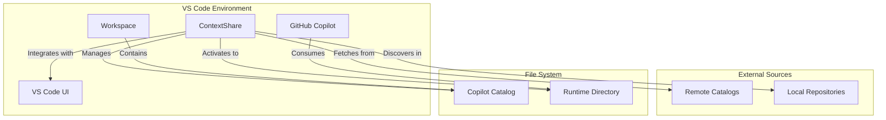
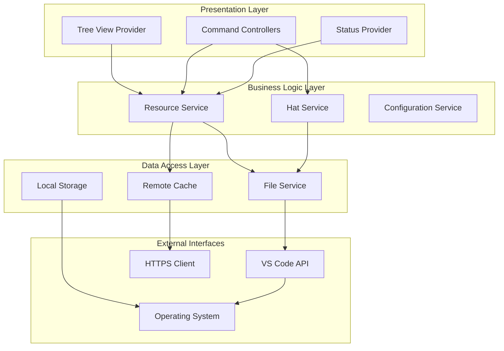
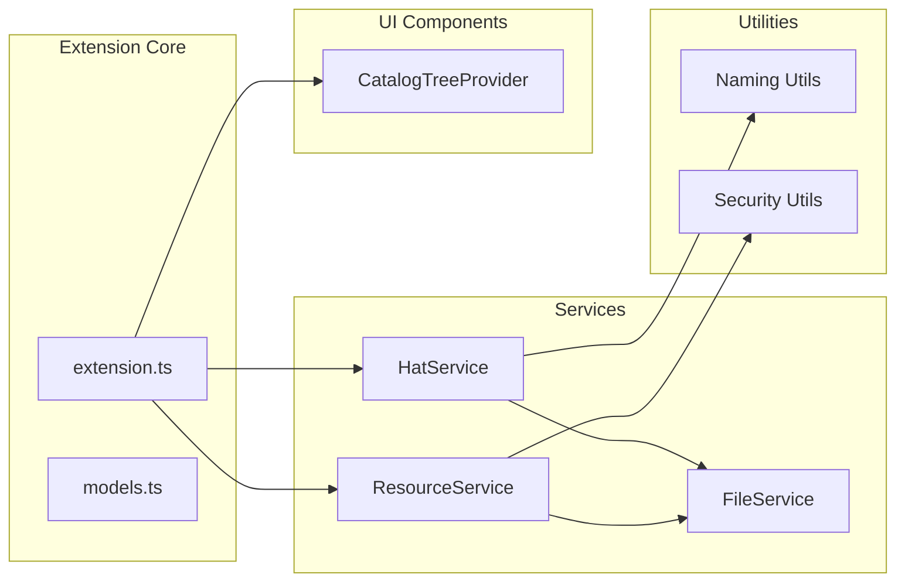
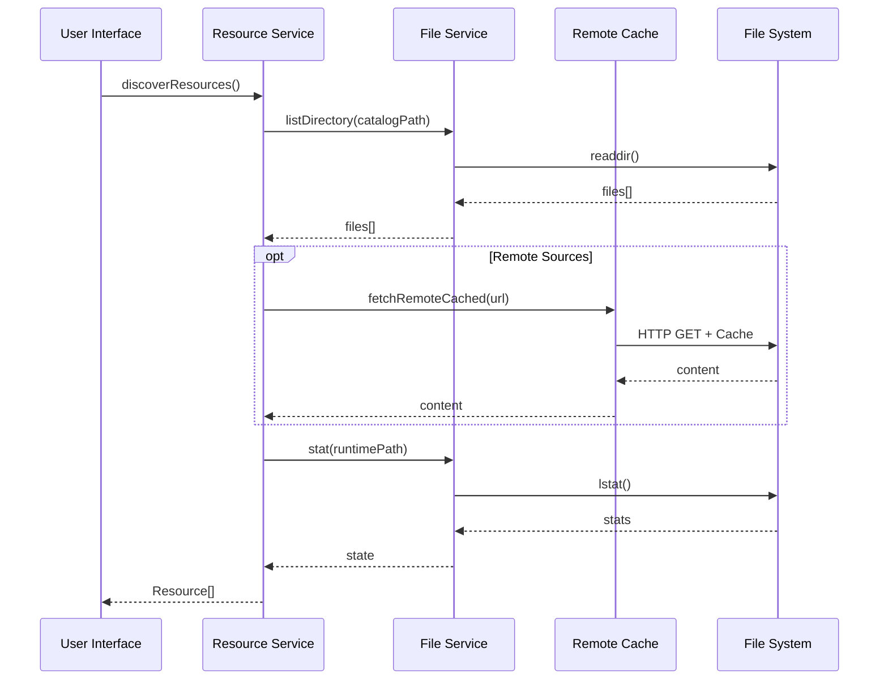
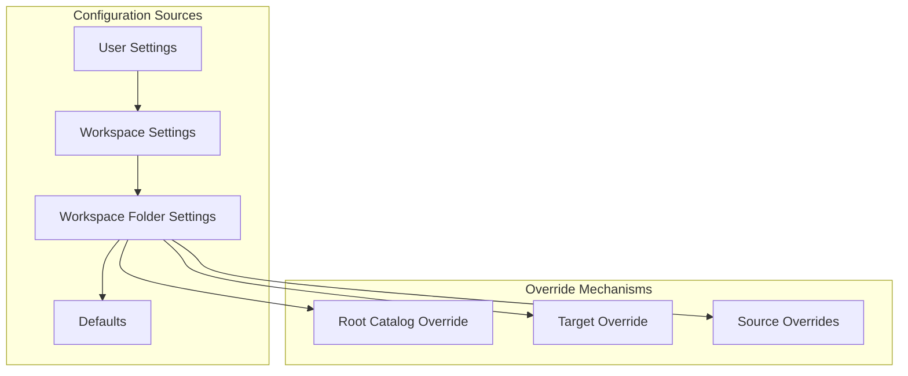
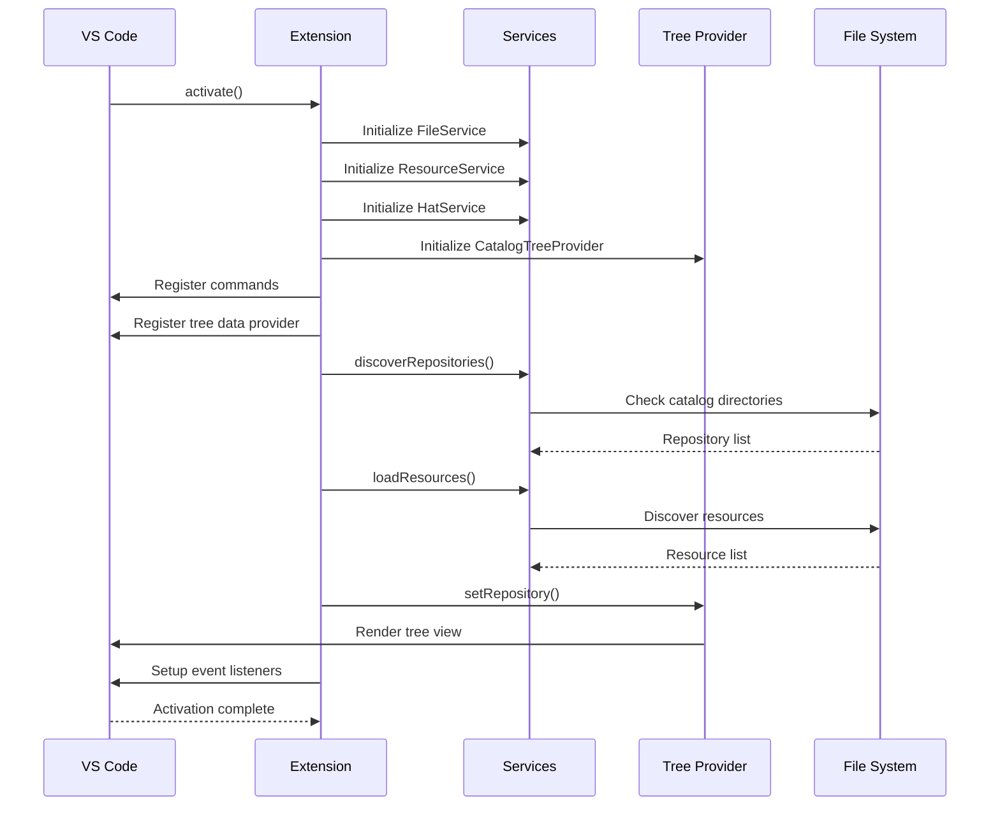
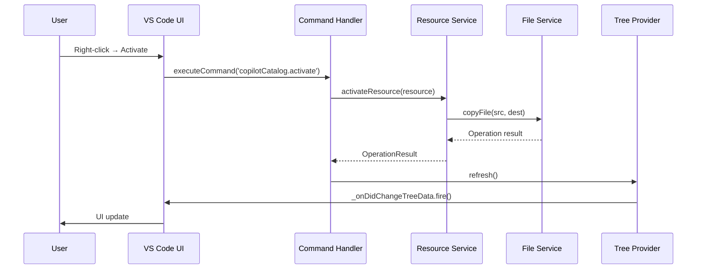
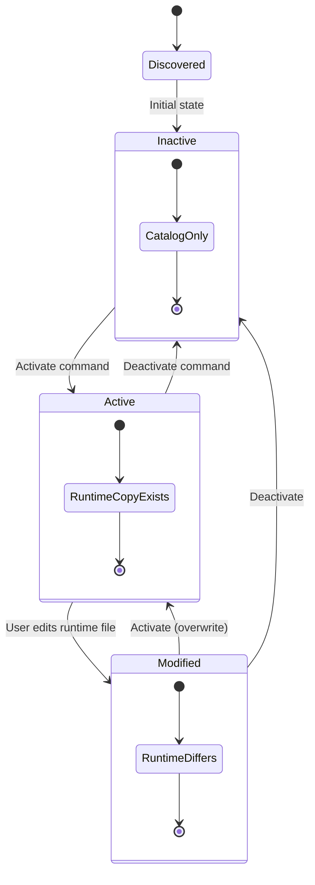
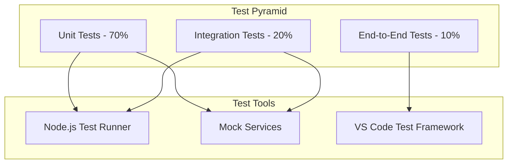
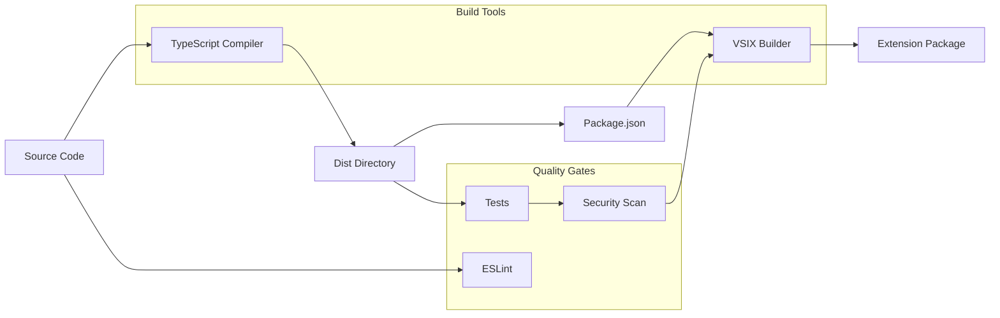

<!-- Copyright (c) Microsoft Corporation.
 Licensed under the MIT License. -->
# Software Architecture Specification
## ContextShare VS Code Extension

**Document Version:** 1.0  
**Last Updated:** August 19, 2025  
**Authors:** System Architecture Team  
**Review Status:** Draft  

---

## Table of Contents

1. [Executive Summary](#1-executive-summary)
2. [System Overview](#2-system-overview)
3. [Architecture Goals and Constraints](#3-architecture-goals-and-constraints)
4. [System Architecture](#4-system-architecture)
5. [Component Architecture](#5-component-architecture)
6. [Data Architecture](#6-data-architecture)
7. [Interface Architecture](#7-interface-architecture)
8. [Security Architecture](#8-security-architecture)
9. [Configuration Management](#9-configuration-management)
10. [Extension Lifecycle](#10-extension-lifecycle)
11. [Testing Architecture](#11-testing-architecture)
12. [Deployment Architecture](#12-deployment-architecture)
13. [Quality Attributes](#13-quality-attributes)
14. [Technical Debt and Risks](#14-technical-debt-and-risks)
15. [Appendices](#15-appendices)

---

## 1. Executive Summary

### 1.1 Purpose

ContextShare is a Visual Studio Code extension designed to manage AI assistant catalog resources (chat modes, instructions, prompts, tasks, and Model Context Protocol assets) across multiple repositories. The extension provides a centralized interface for discovering, activating, and managing AI resources that enhance developer productivity through GitHub Copilot.

### 1.2 System Scope

The extension operates within the VS Code ecosystem as a client-side tool that:
- Discovers AI resources from local and remote catalogs
- Manages resource activation/deactivation states
- Provides a tree-based UI for resource management
- Supports preset configurations ("Hats") for resource groups
- Ensures secure handling of remote content and user modifications

### 1.3 Key Architectural Decisions

- **Service-Oriented Architecture**: Core functionality separated into distinct services
- **Repository Pattern**: Abstracted file system operations through service interfaces
- **Tree Data Provider Pattern**: Native VS Code UI integration
- **State Management**: Centralized resource state tracking
- **Security-First Design**: Input validation and safe file operations

---

## 2. System Overview

### 2.1 System Context



### 2.2 Stakeholders

| Stakeholder | Role | Concerns |
|-------------|------|----------|
| Developers | Primary Users | Ease of use, resource discovery, productivity |
| DevOps Teams | Deployment | Configuration management, remote sources |
| Security Teams | Compliance | Input validation, remote content safety |
| Extension Maintainers | Development | Code maintainability, testability |

---

## 3. Architecture Goals and Constraints

### 3.1 Quality Goals

| Quality Attribute | Priority | Description |
|-------------------|----------|-------------|
| Usability | High | Intuitive interface for resource management |
| Reliability | High | Robust operation across different environments |
| Security | High | Safe handling of remote content and file operations |
| Maintainability | Medium | Clear separation of concerns, testable code |
| Performance | Medium | Responsive UI, efficient resource discovery |
| Extensibility | Medium | Support for new resource types and sources |

### 3.2 Technical Constraints

- **Platform**: VS Code Extension API (v1.90.0+)
- **Runtime**: Node.js environment within VS Code
- **Language**: TypeScript for type safety and maintainability
- **File System**: Cross-platform file operations (Windows, macOS, Linux)
- **Security**: HTTPS-only for remote sources, input sanitization

### 3.3 Business Constraints

- **Offline Operation**: Must function without internet connectivity
- **Multi-Workspace**: Support for multiple repositories in workspace
- **User Control**: Users maintain ownership of their resources
- **Backward Compatibility**: Stable configuration interface

---

## 4. System Architecture

### 4.1 High-Level Architecture



### 4.2 Architectural Patterns

#### 4.2.1 Service Layer Pattern
- **Purpose**: Encapsulate business logic in reusable services
- **Implementation**: ResourceService, HatService, FileService
- **Benefits**: Testability, separation of concerns, reusability

#### 4.2.2 Repository Pattern
- **Purpose**: Abstract data access operations
- **Implementation**: IFileService interface with FileService implementation
- **Benefits**: Testability, mock support, platform abstraction

#### 4.2.3 Observer Pattern
- **Purpose**: React to configuration and file system changes
- **Implementation**: VS Code event listeners, tree data provider events
- **Benefits**: Reactive updates, loose coupling

#### 4.2.4 Command Pattern
- **Purpose**: Encapsulate user actions as commands
- **Implementation**: VS Code command registration and handlers
- **Benefits**: Undo capability, macro recording, extensibility

---

## 5. Component Architecture

### 5.1 Component Overview



### 5.2 Component Details

#### 5.2.1 Extension Core (`extension.ts`)

**Responsibilities:**
- Extension activation and deactivation
- Command registration and handling
- Event listener setup
- Service initialization and dependency injection

**Key Functions:**
```typescript
export async function activate(context: vscode.ExtensionContext)
export function deactivate()
async function refresh()
async function loadResources()
```

**Dependencies:**
- ResourceService
- HatService  
- FileService
- CatalogTreeProvider

#### 5.2.2 Resource Service (`services/resourceService.ts`)

**Responsibilities:**
- Resource discovery from local and remote sources
- Resource state management (inactive, active, modified)
- Resource activation/deactivation operations
- Remote content caching
- Source override handling

**Key Functions:**
```typescript
async discoverResources(repository: Repository): Promise<Resource[]>
async getResourceState(resource: Resource): Promise<ResourceState>
async activateResource(resource: Resource): Promise<OperationResult>
async deactivateResource(resource: Resource): Promise<OperationResult>
setSourceOverrides(overrides: Partial<Record<ResourceCategory,string>>)
setRootCatalogOverride(root?: string)
```

**State Management:**
- Remote cache with TTL-based expiration
- Source override configuration
- Target workspace override
- Resource state computation

#### 5.2.3 Hat Service (`services/hatService.ts`)

**Responsibilities:**
- Hat (preset) discovery from multiple sources
- Hat application (bulk resource activation/deactivation)
- Hat creation from current active resources
- Hat persistence to workspace and user storage

**Key Functions:**
```typescript
async discoverHats(repo: Repository): Promise<Hat[]>
async applyHat(repo: Repository, resources: Resource[], hat: Hat): Promise<ApplyResult>
async createHatFromActive(name: string, resources: Resource[], source: HatSource): Promise<Hat>
async deleteHat(hat: Hat, repo?: Repository): Promise<boolean>
```

**Storage Locations:**
- Catalog: `{catalog}/hats/*.json`
- Workspace: `.vscode/copilot-hats.json`
- User: Global storage `hats.json`

#### 5.2.4 File Service (`services/fileService.ts`)

**Responsibilities:**
- File system operations abstraction
- Cross-platform path handling
- Error handling for file operations
- Directory creation and management

**Interface Definition:**
```typescript
interface IFileService {
  readFile(path: string): Promise<string>
  writeFile(path: string, content: string): Promise<void>
  pathExists(path: string): Promise<boolean>
  listDirectory(path: string): Promise<string[]>
  stat(path: string): Promise<'file'|'dir'|'other'|'missing'>
  copyFile(src: string, dest: string): Promise<void>
  deleteFile?(path: string): Promise<void>
}
```

#### 5.2.5 Catalog Tree Provider (`tree/catalogTreeProvider.ts`)

**Responsibilities:**
- VS Code tree view data provision
- Resource visualization and grouping
- Icon and context menu management
- Tree state management and refresh

**Key Functions:**
```typescript
getTreeItem(element: CatalogTreeItem): CatalogTreeItem
getChildren(element?: CatalogTreeItem): CatalogTreeItem[]
setRepository(repo: Repository, resources: Resource[])
refresh()
```

**Tree Structure:**
```
Repository
├── chatmodes (2/5)
│   ├── default.chatmode.md [active]
│   ├── agent-debug.chatmode.md [inactive]
│   └── user.custom.chatmode.md [user]
├── • • • • •
├── instructions (1/3)
│   ├── general.instructions.md [active]
│   └── hw-design.instructions.md [modified]
└── prompts (0/2)
    ├── init.prompt.md [inactive]
    └── debug.prompt.md [inactive]
```

### 5.3 Utility Components

#### 5.3.1 Naming Utilities (`utils/naming.ts`)

**Purpose:** Generate consistent filenames for user variants
**Key Function:**
```typescript
generateUserVariantFilename(original: string, existing: Set<string>): string
```

**Naming Convention:**
- First variant: `user.{original}`
- Subsequent: `user.{N}.{original}`

#### 5.3.2 Security Utilities (`utils/security.ts`)

**Purpose:** Input validation and sanitization
**Key Functions:**
```typescript
sanitizeFilename(name: string): string
isSafeRelativeEntry(entry: string): boolean
```

**Security Measures:**
- Path traversal prevention
- Filename sanitization
- Relative path validation

---

## 6. Data Architecture

### 6.1 Data Models

#### 6.1.1 Core Entities

```typescript
interface Repository {
  id: string
  name: string
  rootPath: string      // Workspace folder root
  catalogPath: string   // Path to copilot_catalog
  runtimePath: string   // Target directory (.github)
  isActive: boolean
}

interface Resource {
  id: string
  relativePath: string     // Catalog-relative path
  absolutePath: string     // Absolute file system path
  category: ResourceCategory
  targetSubdir: string
  repository: Repository
  state: ResourceState
  origin: ResourceOrigin
  disabled?: boolean       // For user resources
}

interface Hat {
  id: string
  name: string
  description?: string
  resources: string[]      // Relative paths
  source: HatSource
  definitionPath?: string
}
```

#### 6.1.2 Enumerations

```typescript
enum ResourceCategory {
  CHATMODES = 'chatmodes',
  INSTRUCTIONS = 'instructions', 
  PROMPTS = 'prompts',
  TASKS = 'tasks',
  MCP = 'mcp'
}

enum ResourceState {
  INACTIVE = 0,  // Not copied to runtime
  ACTIVE = 1,    // Copied and unchanged
  MODIFIED = 2   // Copied and locally modified
}

enum ResourceOrigin {
  CATALOG = 'catalog',  // From catalog directory
  USER = 'user',        // User-created in runtime
  REMOTE = 'remote'     // Fetched from remote source
}
```

### 6.2 Data Flow



### 6.3 Caching Strategy

#### 6.3.1 Remote Content Cache

**Location:** In-memory Map with disk persistence
**TTL:** Configurable (default: 5 minutes)
**Eviction:** Time-based expiration

```typescript
private remoteCache: Map<string, {
  timestamp: number
  content: string
}> = new Map()
```

#### 6.3.2 Configuration Cache

**Location:** VS Code configuration system
**Scope:** Workspace and user settings
**Invalidation:** Configuration change events

---

## 7. Interface Architecture

### 7.1 VS Code Extension API Integration

#### 7.1.1 Activation Events

```json
{
  "activationEvents": ["onStartupFinished"],
  "main": "dist/src/extension.js"
}
```

#### 7.1.2 Contribution Points

**Views and Containers:**
```json
{
  "viewsContainers": {
    "activitybar": [{
      "id": "copilotCatalog",
      "title": "Copilot Catalog", 
      "icon": "resources/activity-icon-book.svg"
    }]
  },
  "views": {
    "copilotCatalog": [{
      "id": "copilotCatalogView",
      "name": "Catalog"
    }]
  }
}
```

**Commands:**
- `copilotCatalog.refresh` - Refresh resource discovery
- `copilotCatalog.activate` - Activate selected resource
- `copilotCatalog.deactivate` - Deactivate selected resource
- `copilotCatalog.showDiff` - Show differences between catalog and runtime
- `copilotCatalog.hats.apply` - Apply hat preset
- `copilotCatalog.openResource` - Open resource for viewing/editing

**Configuration Schema:**
```json
{
  "copilotCatalog.catalogDirectory": {
    "type": "string",
    "default": "copilot_catalog",
    "description": "Name of the catalog directory"
  },
  "copilotCatalog.runtimeDirectory": {
    "type": "string", 
    "default": ".github",
    "description": "Runtime directory for active resources"
  },
  "copilotCatalog.source.rootCatalogPath": {
    "type": "string",
    "description": "Root path for recursive resource discovery"
  }
}
```

### 7.2 Command Interface

#### 7.2.1 Command Registration Pattern

```typescript
context.subscriptions.push(
  vscode.commands.registerCommand('copilotCatalog.activate', async (item: any) => {
    const resource = pickResourceFromItem(item)
    if (!resource) return
    
    await resourceService.activateResource(resource)
    tree.refresh()
    updateStatus()
  })
)
```

#### 7.2.2 Context Menu Integration

```json
{
  "menus": {
    "view/item/context": [{
      "when": "view == copilotCatalogView && viewItem == resource-inactive",
      "command": "copilotCatalog.activate",
      "group": "inline@1"
    }]
  }
}
```

### 7.3 File System Interface

#### 7.3.1 Path Resolution

**Catalog Discovery:**
```typescript
// Standard catalog location
const catalogPath = path.join(repository.rootPath, catalogDirName)

// Override support
const resolvedPath = this.resolveSourceDir(repository, override)
```

**Runtime Target:**
```typescript
// Standard runtime location  
const runtimePath = path.join(repository.runtimePath, targetSubdir, filename)

// Target workspace override
const targetPath = this.targetWorkspaceOverride 
  ? path.join(this.targetWorkspaceOverride, runtimeDirName, targetSubdir, filename)
  : standardRuntimePath
```

#### 7.3.2 Remote Source Interface

**HTTPS-Only Policy:**
```typescript
if (override && /^https?:\/\//i.test(override)) {
  if (!/^https:\/\//i.test(override)) {
    // Skip insecure HTTP sources
    continue
  }
  // Process HTTPS source
}
```

**Directory Listing Format:**
```json
{
  "index.json": [
    "default.chatmode.md",
    "agent-debug.chatmode.md",
    "hw-designer.chatmode.md"
  ]
}
```

---

## 8. Security Architecture

### 8.1 Security Principles

1. **Defense in Depth**: Multiple layers of input validation
2. **Principle of Least Privilege**: Minimal file system access
3. **Secure by Default**: HTTPS-only remote sources
4. **Input Validation**: All external input sanitized

### 8.2 Threat Model

#### 8.2.1 Identified Threats

| Threat | Impact | Mitigation |
|--------|---------|------------|
| Path Traversal | High | Input validation, relative path checks |
| Remote Code Injection | High | Content sanitization, no code execution |
| Malicious Filenames | Medium | Filename sanitization |
| MITM Attacks | Medium | HTTPS-only policy |
| Configuration Tampering | Medium | Schema validation |

#### 8.2.2 Security Controls

**Input Validation:**
```typescript
export function sanitizeFilename(name: string): string {
  const base = (name || '').split(/[\\/]/).pop() || ''
  const cleaned = base.replace(/[\0<>:\"|?*]/g, '').trim()
  if (cleaned === '' || cleaned === '.' || cleaned === '..') {
    return 'file.txt'
  }
  return cleaned
}

export function isSafeRelativeEntry(entry: string): boolean {
  if (!entry) return false
  if (/^[a-zA-Z]:[\\/]/.test(entry)) return false  // Drive letters
  if (entry.startsWith('/') || entry.startsWith('\\')) return false  // Absolute paths
  if (entry.includes('..')) return false  // Path traversal
  return true
}
```

**Network Security:**
```typescript
// HTTPS-only enforcement
if (!/^https:\/\//i.test(override)) {
  continue  // Skip insecure sources
}
```

### 8.3 Data Privacy

#### 8.3.1 Data Handling

- **Local Data**: Remains on user's machine
- **Remote Caching**: Temporary, TTL-based expiration
- **Logging**: Optional, privacy-friendly (no sensitive data)
- **Telemetry**: None collected by extension

#### 8.3.2 User Control

- Users control all source configurations
- Explicit consent for remote source usage
- Clear indication of data origins (catalog/user/remote)
- Ability to disable remote sources entirely

---

## 9. Configuration Management

### 9.1 Configuration Hierarchy



### 9.2 Configuration Schema

#### 9.2.1 Core Settings

```json
{
  "copilotCatalog.catalogDirectory": {
    "type": "string",
    "default": "copilot_catalog",
    "description": "Name of the catalog directory in repositories"
  },
  "copilotCatalog.runtimeDirectory": {
    "type": "string", 
    "default": ".github",
    "description": "Name of the runtime directory for active resources"
  },
  "copilotCatalog.targetWorkspace": {
    "type": "string",
    "default": "",
    "description": "Explicitly sets the target workspace folder for activating resources"
  }
}
```

#### 9.2.2 Source Configuration

```json
{
  "copilotCatalog.source.rootCatalogPath": {
    "type": "string",
    "default": "",
    "description": "Single root path for recursive resource discovery"
  },
  "copilotCatalog.source.chatmodes": {
    "type": "string", 
    "default": "",
    "description": "Override source path/URL for chatmodes"
  },
  "copilotCatalog.source.instructions": {
    "type": "string",
    "default": "",
    "description": "Override source path/URL for instructions"
  }
}
```

#### 9.2.3 Behavior Settings

```json
{
  "copilotCatalog.autoRefresh": {
    "type": "boolean",
    "default": true,
    "description": "Automatically refresh when files change"
  },
  "copilotCatalog.showModificationWarnings": {
    "type": "boolean",
    "default": true, 
    "description": "Warn when activating over modified files"
  },
  "copilotCatalog.taskMergeStrategy": {
    "type": "string",
    "enum": ["merge", "replace", "skip"],
    "default": "merge",
    "description": "Strategy for handling task conflicts"
  }
}
```

### 9.3 Configuration Change Handling

```typescript
vscode.workspace.onDidChangeConfiguration(async (e: vscode.ConfigurationChangeEvent) => {
  const reloadKeys = [
    'copilotCatalog.catalogDirectory',
    'copilotCatalog.runtimeDirectory'
  ]
  
  const refreshKeys = [
    'copilotCatalog.source.rootCatalogPath',
    'copilotCatalog.targetWorkspace'
  ]
  
  if (reloadKeys.some(k => e.affectsConfiguration(k))) {
    // Require window reload for structural changes
    vscode.window.showInformationMessage(
      'Settings changed that require reload',
      'Reload Window'
    )
  } else if (refreshKeys.some(k => e.affectsConfiguration(k))) {
    // Refresh for configuration changes
    await refresh()
  }
})
```

---

## 10. Extension Lifecycle

### 10.1 Activation Sequence



### 10.2 Command Execution Flow



### 10.3 Resource State Transitions



### 10.4 Error Handling Strategy

#### 10.4.1 Error Categories

| Category | Handling Strategy | User Experience |
|----------|-------------------|-----------------|
| File System | Graceful degradation | Warning notification |
| Network | Timeout and retry | Status indicator |
| Configuration | Validation and fallback | Settings guidance |
| User Input | Sanitization and validation | Inline error messages |

#### 10.4.2 Error Propagation

```typescript
async function activateResource(resource: Resource): Promise<OperationResult> {
  try {
    await this.fileService.copyFile(resource.absolutePath, targetPath)
    return { success: true, resource, message: 'Activated successfully' }
  } catch (error) {
    const message = error instanceof Error ? error.message : 'Unknown error'
    return { 
      success: false, 
      resource, 
      message: `Activation failed: ${message}`,
      details: error instanceof Error ? error.stack : undefined
    }
  }
}
```

---

## 11. Testing Architecture

### 11.1 Testing Strategy

#### 11.1.1 Test Pyramid



#### 11.1.2 Test Categories

**Unit Tests:**
- Service logic validation
- Utility function testing
- Model validation
- Error handling verification

**Integration Tests:**
- Service interaction testing
- File system integration
- Configuration handling
- Command execution

**End-to-End Tests:**
- Complete user workflows
- VS Code integration
- UI behavior validation

### 11.2 Test Implementation

#### 11.2.1 Service Testing

```typescript
describe('ResourceService', () => {
  let resourceService: ResourceService
  let mockFileService: IFileService
  
  beforeEach(() => {
    mockFileService = new MockFileService()
    resourceService = new ResourceService(mockFileService)
  })
  
  it('should discover resources from catalog directory', async () => {
    // Arrange
    mockFileService.setupDirectory('/repo/copilot_catalog/chatmodes', [
      'default.chatmode.md',
      'agent.chatmode.md'
    ])
    
    // Act
    const resources = await resourceService.discoverResources(mockRepository)
    
    // Assert
    expect(resources).toHaveLength(2)
    expect(resources[0].category).toBe(ResourceCategory.CHATMODES)
  })
})
```

#### 11.2.2 Mock Services

```typescript
export class MockFileService implements IFileService {
  private files = new Map<string, string>()
  private directories = new Map<string, string[]>()
  
  setupFile(path: string, content: string) {
    this.files.set(path, content)
  }
  
  setupDirectory(path: string, entries: string[]) {
    this.directories.set(path, entries)
  }
  
  async readFile(path: string): Promise<string> {
    if (!this.files.has(path)) {
      throw new Error(`File not found: ${path}`)
    }
    return this.files.get(path)!
  }
  
  async listDirectory(path: string): Promise<string[]> {
    return this.directories.get(path) || []
  }
}
```

### 11.3 Test Execution

#### 11.3.1 Test Scripts

```json
{
  "scripts": {
    "test": "node dist/test/resourceService.test.js && node dist/test/naming.test.js",
    "test:all": "npm run test && npm run test:integration",
    "test:watch": "npm run build && npm run test",
    "test:coverage": "nyc npm run test"
  }
}
```

#### 11.3.2 Continuous Integration

```yaml
# .github/workflows/test.yml
name: Test
on: [push, pull_request]
jobs:
  test:
    runs-on: ubuntu-latest
    steps:
      - uses: actions/checkout@v2
      - uses: actions/setup-node@v2
        with:
          node-version: '18'
      - run: npm install
      - run: npm run build
      - run: npm test
```

---

## 12. Deployment Architecture

### 12.1 Build Process

#### 12.1.1 Build Pipeline



#### 12.1.2 Build Scripts

```bash
#!/bin/bash
# build_vsix.sh

set -e

echo "Building ContextShare VSIX..."

# Clean previous build
rm -f *.vsix
rm -rf dist/

# Build TypeScript
npm run build

# Create VSIX package
npx vsce package --no-dependencies

echo "VSIX package created successfully"
ls -la *.vsix
```

### 12.2 Installation Methods

#### 12.2.1 VS Code Marketplace

**Publishing Process:**
1. Version increment in `package.json`
2. CHANGELOG update
3. Build and test validation
4. VSIX package creation
5. Marketplace upload via `vsce publish`

#### 12.2.2 Manual Installation

```bash
# Install latest built version
LATEST_VSIX=$(ls -1 *.vsix | sort -V | tail -n 1)
code --install-extension $LATEST_VSIX --force
```

#### 12.2.3 Development Installation

```bash
# Install development version
npm install --prefix contextshare-extension/
bash contextshare-extension/build_vsix.sh
bash contextshare-extension/install_locally.sh
```

### 12.3 Update Management

#### 12.3.1 Version Strategy

**Semantic Versioning:**
- `MAJOR.MINOR.PATCH`
- Breaking changes increment MAJOR
- New features increment MINOR  
- Bug fixes increment PATCH

**Update Process:**
1. Automatic updates via VS Code marketplace
2. Manual update check in Extensions view
3. Development builds require manual installation

#### 12.3.2 Backward Compatibility

**Configuration Migration:**
- Deprecated settings remain functional
- New settings provide enhanced functionality
- Migration warnings for obsolete configurations

**Data Migration:**
- Hat file format evolution
- Configuration schema updates
- User data preservation

---

## 13. Quality Attributes

### 13.1 Performance Characteristics

#### 13.1.1 Resource Discovery Performance

| Operation | Target | Measurement |
|-----------|---------|-------------|
| Local Discovery | < 1s | 1000 resources |
| Remote Discovery | < 5s | With network timeout |
| Tree Refresh | < 200ms | UI responsiveness |
| Configuration Change | < 100ms | Setting updates |

#### 13.1.2 Memory Usage

- **Baseline**: < 10MB at startup
- **Resource Cache**: < 1MB per 100 remote resources
- **UI State**: < 1MB for tree data
- **Peak Usage**: < 50MB under heavy load

#### 13.1.3 Performance Monitoring

```typescript
// Performance tracking example
const startTime = performance.now()
const resources = await resourceService.discoverResources(repository)
const duration = performance.now() - startTime
log(`Resource discovery completed in ${duration.toFixed(2)}ms`)
```

### 13.2 Reliability Measures

#### 13.2.1 Error Recovery

- **File System Errors**: Graceful degradation, retry logic
- **Network Errors**: Timeout handling, offline operation
- **Configuration Errors**: Validation, fallback to defaults
- **Resource Conflicts**: User choice dialogs, preservation options

#### 13.2.2 Data Integrity

- **Atomic Operations**: Complete or rollback file operations
- **Backup Creation**: Optional backup before overwrite
- **State Consistency**: Resource state recomputation on changes
- **Validation**: Input sanitization and schema validation

### 13.3 Usability Features

#### 13.3.1 User Experience

- **Progressive Disclosure**: Hierarchical tree view
- **Visual Feedback**: Icons, tooltips, status indicators
- **Contextual Actions**: Right-click menus, inline buttons
- **Error Communication**: Clear error messages, suggested actions

#### 13.3.2 Accessibility

- **Keyboard Navigation**: Full keyboard support
- **Screen Reader Support**: Proper ARIA labels
- **High Contrast**: Theme-aware icons and colors
- **Focus Management**: Logical tab order

### 13.4 Security Measures

#### 13.4.1 Input Validation

```typescript
export function validateResourcePath(path: string): boolean {
  // Path length limits
  if (path.length > 260) return false
  
  // Character restrictions
  if (/[\0<>:"|?*]/.test(path)) return false
  
  // Path traversal prevention
  if (path.includes('..')) return false
  
  return true
}
```

#### 13.4.2 Secure Defaults

- HTTPS-only for remote sources
- No automatic code execution
- Read-only catalog resource viewing
- Explicit user consent for destructive operations

---

## 14. Technical Debt and Risks

### 14.1 Current Technical Debt

#### 14.1.1 Code Quality Issues

| Issue | Priority | Impact | Resolution Plan |
|-------|----------|---------|----------------|
| Large extension.ts file | Medium | Maintainability | Extract command handlers |
| Minimal error typing | Low | Debugging | Implement error types |
| Limited test coverage | Medium | Quality assurance | Expand test suite |
| Configuration complexity | High | User experience | Simplify settings |

#### 14.1.2 Dependencies

**External Dependencies:**
- VS Code API: Extension locked to specific API versions
- Node.js: File system API dependencies
- TypeScript: Build-time dependency for type safety

**Risk Mitigation:**
- Regular dependency updates
- API compatibility testing
- Graceful degradation for missing features

### 14.2 Identified Risks

#### 14.2.1 Technical Risks

| Risk | Probability | Impact | Mitigation |
|------|-------------|---------|------------|
| VS Code API changes | Medium | High | API version pinning, feature detection |
| File system permissions | Low | Medium | Permission checking, error handling |
| Remote source availability | High | Low | Caching, offline operation |
| Configuration corruption | Low | High | Validation, backup mechanisms |

#### 14.2.2 Security Risks

| Risk | Probability | Impact | Mitigation |
|------|-------------|---------|------------|
| Malicious remote content | Medium | High | HTTPS-only, content validation |
| Path traversal attacks | Low | High | Input sanitization, path validation |
| Configuration injection | Low | Medium | Schema validation, type checking |

### 14.3 Future Improvements

#### 14.3.1 Performance Optimizations

- **Lazy Loading**: Load resources on-demand
- **Virtual Scrolling**: Handle large resource lists
- **Background Refresh**: Non-blocking updates
- **Incremental Discovery**: Delta-based updates

#### 14.3.2 Feature Enhancements

- **Resource Versioning**: Track resource history
- **Conflict Resolution**: Advanced merge strategies
- **Bulk Operations**: Multi-select actions
- **Search and Filter**: Resource discovery tools

#### 14.3.3 Architecture Evolution

- **Plugin System**: Extensible resource types
- **Service Workers**: Background processing
- **Event Sourcing**: Audit trail for changes
- **GraphQL API**: Structured remote queries

---

## 15. Appendices

### 15.1 Glossary

| Term | Definition |
|------|------------|
| **Catalog** | Directory containing AI resource templates |
| **Hat** | Named preset of resources for bulk activation |
| **Resource** | Individual AI asset (chatmode, instruction, prompt, task, MCP) |
| **Runtime** | Directory where active resources are copied for use |
| **Activation** | Process of copying catalog resource to runtime directory |
| **Origin** | Source type of resource (catalog, user, remote) |
| **State** | Current status of resource (inactive, active, modified) |

### 15.2 File System Conventions

#### 15.2.1 Directory Structure

```
workspace/
├── copilot_catalog/              # Source catalog
│   ├── chatmodes/
│   │   ├── default.chatmode.md
│   │   └── agent.chatmode.md
│   ├── instructions/
│   │   └── general.instructions.md
│   ├── prompts/
│   │   └── init.prompt.md
│   ├── tasks/
│   │   └── build.task.json
│   ├── mcp/
│   │   └── servers.mcp.json
│   └── hats/
│       └── preset.json
├── .github/                      # Runtime directory
│   ├── chatmodes/
│   ├── instructions/
│   ├── prompts/
│   ├── tasks/
│   └── mcp/
└── .vscode/
    ├── settings.json
    └── copilot-hats.json        # Workspace hats
```

#### 15.2.2 Naming Conventions

**Resource Files:**
- `{name}.{category}.{ext}` (e.g., `default.chatmode.md`)
- Category inferred from filename or directory

**User Resources:**
- `user.{original}` (first variant)
- `user.{N}.{original}` (subsequent variants)

**Hat Files:**
- Catalog: `{catalog}/hats/{name}.json`
- Workspace: `.vscode/copilot-hats.json`
- User: `{globalStorage}/hats.json`

### 15.3 Configuration Examples

#### 15.3.1 Basic Configuration

```json
{
  "copilotCatalog.catalogDirectory": "copilot_catalog",
  "copilotCatalog.runtimeDirectory": ".github",
  "copilotCatalog.autoRefresh": true
}
```

#### 15.3.2 Remote Source Configuration

```json
{
  "copilotCatalog.source.rootCatalogPath": "https://example.com/catalog/",
  "copilotCatalog.remoteCacheTtlSeconds": 600
}
```

#### 15.3.3 Advanced Configuration

```json
{
  "copilotCatalog.targetWorkspace": "/absolute/path/to/target",
  "copilotCatalog.source.chatmodes": "https://cdn.example.com/chatmodes/",
  "copilotCatalog.source.instructions": "/shared/instructions",
  "copilotCatalog.taskMergeStrategy": "merge",
  "copilotCatalog.backupBeforeOverwrite": true
}
```

### 15.4 API Reference

#### 15.4.1 Extension Commands

```typescript
// Command registrations
'copilotCatalog.refresh': () => Promise<void>
'copilotCatalog.activate': (item: TreeItem) => Promise<void>
'copilotCatalog.deactivate': (item: TreeItem) => Promise<void>
'copilotCatalog.showDiff': (item: TreeItem) => Promise<void>
'copilotCatalog.hats.apply': () => Promise<void>
'copilotCatalog.openResource': (item: TreeItem) => Promise<void>
```

#### 15.4.2 Service Interfaces

```typescript
interface IResourceService {
  discoverResources(repo: Repository): Promise<Resource[]>
  getResourceState(resource: Resource): Promise<ResourceState>
  activateResource(resource: Resource, options?: ActivateOptions): Promise<OperationResult>
  deactivateResource(resource: Resource): Promise<OperationResult>
  getTargetPath(resource: Resource): string
}

interface IFileService {
  readFile(path: string): Promise<string>
  writeFile(path: string, content: string): Promise<void>
  pathExists(path: string): Promise<boolean>
  listDirectory(path: string): Promise<string[]>
  stat(path: string): Promise<'file'|'dir'|'other'|'missing'>
  copyFile(src: string, dest: string): Promise<void>
}
```

### 15.5 Troubleshooting Guide

#### 15.5.1 Common Issues

**No resources discovered:**
1. Check catalog directory exists and contains resources
2. Verify `copilotCatalog.catalogDirectory` setting
3. Use "Refresh" command to re-scan
4. Check Output panel for error messages

**Remote sources not loading:**
1. Verify HTTPS URL is accessible
2. Check network connectivity
3. Validate remote index.json format
4. Review cache TTL settings

**Resource activation fails:**
1. Check file system permissions
2. Verify target directory exists
3. Review error in Output panel
4. Check for file conflicts

#### 15.5.2 Debug Information

**Diagnostics Command:**
Use `copilotCatalog.diagnostics` to output configuration and state information.

**Log Output:**
Enable `copilotCatalog.enableFileLogging` for persistent debug logs.

**Manual Verification:**
1. Check `.vscode/settings.json` for configuration
2. Verify catalog directory structure
3. Examine runtime directory contents
4. Review hat definitions in `.vscode/copilot-hats.json`

---

## Document History

| Version | Date | Author | Changes |
|---------|------|--------|---------|
| 1.0 | 2025-08-19 | System Architecture Team | Initial comprehensive specification |

---

**Document Classification:** Internal  
**Review Required:** Annual or on major architecture changes  
**Approval:** Technical Lead, Product Owner  

---

*This document serves as the definitive architectural reference for the ContextShare VS Code Extension. All development, maintenance, and evolution decisions should align with the principles and patterns described herein.*
